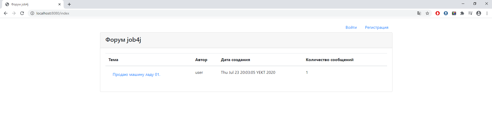

# job4j_forum

Приложение "Форум" включает в себя 5 страниц:

<ul>
 <li>index.jsp - главная страница со списком тем:
    <ul>
        <li>
            для неавторизованного пользователя:
            
        </li>
        <li>
            для авторизованного пользователя:
            
        </li>
    </ul>
 </li>
 <li>post.jsp - страница с темой и обсуждениями:
     <ul>
         <li>
             для неавторизованного пользователя:
             
         </li>
         <li>
             для авторизованного пользователя:
             
         </li>
     </ul>
  </li>
  <li>
    reg.jsp - страница регистрации пользователя:
    
   </li>
   <li>
     login.jsp - страница авторизации пользователя:
     
    </li>
    <li>
         edit.jsp - страница создания или редактирования темы:
         
     </li>
</ul>